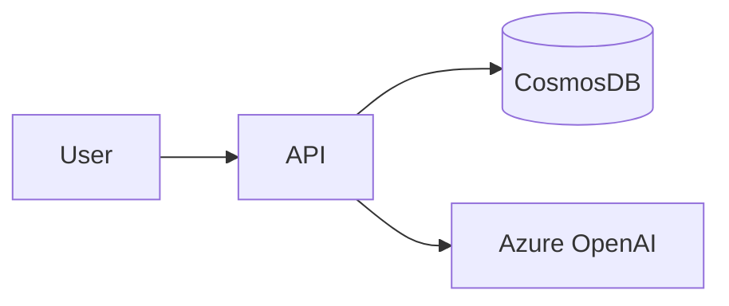

# 図表・ダイアグラムの記載ルール

`docs/` 配下のドキュメント内に図表を埋め込む時の **配置先・記法選択・更新ルール** を定義する。図に関する真実の単一の場所として運用する。

## 関連ファイルとの棲み分け

| ファイル | 役割 |
|---|---|
| 本ファイル（[`diagrams.md`](diagrams.md)） | 図に特化した配置先・記法選択・OK/NG 例・更新ルール |
| [`docs-content.md`](docs-content.md) | 8 ファイルの役割分担（どのファイルに何を書くか） |
| [`docs-style.md`](docs-style.md) | 図以外の書式（リンク・章番号・コード長・用語等） |

---

## 1. 記載場所

設計図やダイアグラムは、関連する永続的ドキュメント内に直接記載する。独立した `diagrams/` フォルダは作成せず、手間を最小限に抑える。

### 配置例

| 図の種類 | 配置先 |
|---|---|
| ER 図、データモデル図 | [`functional-design.md`](../../docs/functional-design.md) |
| ユースケース図 | [`functional-design.md`](../../docs/functional-design.md) または [`product-requirements.md`](../../docs/product-requirements.md) |
| 画面遷移図、ワイヤフレーム | [`functional-design.md`](../../docs/functional-design.md) |
| システム構成図 | [`functional-design.md`](../../docs/functional-design.md) または [`architecture.md`](../../docs/architecture.md) |
| 作業計画（steering）の処理フロー・依存関係 | `docs/.steering/[作業名]/design.md`（詳細は [`.steering.md`](.steering.md) 参照） |

---

## 2. 記述形式の選択

### 2.1 Mermaid（原則）

設計書・要件書・steering ドキュメントの図は **原則 Mermaid を使う**。

- Markdown に直接埋め込める
- バージョン管理が容易（テキスト diff で差分が読める）
- ツール不要で編集可能
- GitHub・主要 IDE でレンダリングされる

### 2.2 ASCII アートを使ってよい例外

以下に該当する場合のみ ASCII 可：

| 例外 | 理由 |
|---|---|
| **ワイヤフレーム / 画面レイアウト** | UI のボックス配置を視覚的に表現するのに ASCII の方が直感的。Mermaid でも書けるが冗長になりがち |
| **ディレクトリツリー** | ファイル階層の表現は ASCII（`├──` `└──`）が業界標準 |
| **テキスト中心の依存方向図（矢印 1〜2 本）** | `api → agent → repositories` のような単純な関係。複雑になったら Mermaid に切替 |

上記以外の図（システム構成・状態遷移・シーケンス・ER 図・フローチャート等）は **Mermaid 必須**。

### 2.3 画像ファイル（最小限）

複雑なワイヤフレームやモックアップで Mermaid / ASCII では表現が困難な場合のみ：

- `docs/images/` フォルダに配置
- PNG または SVG 形式を推奨
- ファイル名は `[ドキュメント名]-[図名].png` のように紐付けが分かる命名

---

## 3. OK / NG 例

### OK 例：システム構成図は Mermaid

````markdown

````

### OK 例：ディレクトリツリーは ASCII

```
backend/
├── app/
│   ├── api/
│   └── agent/
└── tests/
```

### OK 例：ワイヤフレームは ASCII

```
┌────────────────────────────┐
│ Header                     │
├────────────────────────────┤
│ MessageList                │
├────────────────────────────┤
│ Input + Send button        │
└────────────────────────────┘
```

### NG 例：複雑なシステム構成を ASCII で書く

```
┌──────────┐    ┌──────────┐    ┌──────────┐
│  Client  │───>│   API    │───>│    DB    │
└──────────┘    └──────────┘    └──────────┘
       │              │
       │              ▼
       │       ┌──────────────┐
       └──────>│ Application  │
               │   Insights   │
               └──────────────┘
```

→ Mermaid に置き換える。複数経路・複数依存先がある時点で Mermaid のほうが読みやすい。

### NG 例：ER 図を ASCII で書く

```
USERS (id, email, role)
  |
  | 1..N
  |
CONVERSATIONS (id, user_id)
```

→ Mermaid の `erDiagram` を使う。

---

## 4. 図表の更新

- **設計変更時は対応する図表も同時に更新する**。図と本文・コードの乖離を防ぐ
- 古くなった図は削除する（残しても誰も信用しなくなる）
- Mermaid のレンダリング崩れは PR レビュー時にプレビューで確認する

---

## 関連ドキュメント

- ファイルの役割分担 → [`docs-content.md`](docs-content.md)
- 図以外の書式 → [`docs-style.md`](docs-style.md)
- steering の図運用 → [`.steering.md`](.steering.md)
