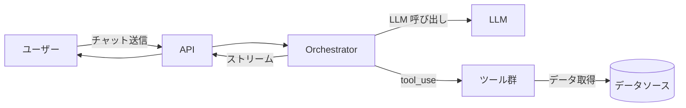
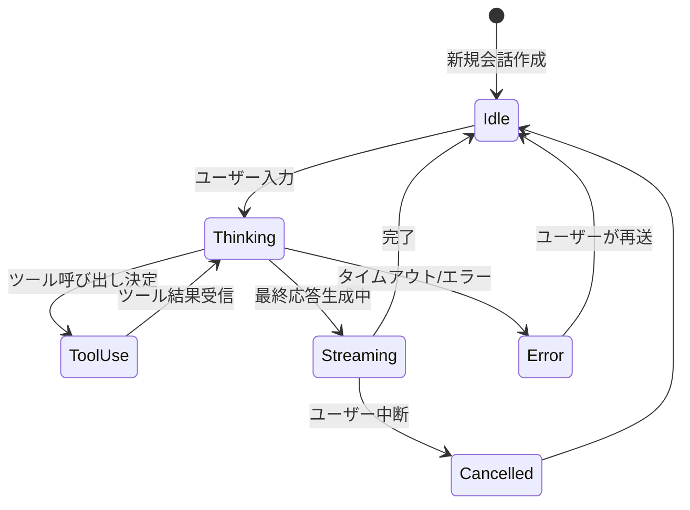

# エージェント設計書

> **AI エージェント機能を使わない案件では、本 callout を `> **status: not-applicable** — 本案件ではエージェント機能を使用しないため未使用` に書き換えてファイル本体は残す**（ファイルごと削除すると manage-context スキルの必須 doc 検査に引っかかるため）。詳細は [`docs-content.md`](../.claude/rules/docs-content.md) を参照。

ユーザーから見える仕様は [`functional-design.md`](functional-design.md)、技術構造は [`architecture.md`](architecture.md) に記載する。
このファイルは **エージェント自身の内部設計** に集中する（プロンプト・ツール・メモリ・モデル・ストリーミング・コスト予算・ガードレール・拡張ポイント）。

> **本テンプレの想定**: AI エージェント Web アプリ。具体的な実装スタック（言語 / フレームワーク / LLM プロバイダ / ライブラリ）は移植先で決定し、本ファイル中の `{...}` プレースホルダと「例: {...}」併記を該当する技術名に置換する。コード例は冒頭にコメントで「例（{言語/FW}）」を明示している。

---

## 1. エージェント構成

### 1.1 基本方針

{単一エージェント前提か、マルチエージェントか。1 つの ReAct ループが LLM 呼び出しとツール実行を繰り返す等の方針を 1〜3 行で記載}



### 1.2 責務分担

| コンポーネント | 責務 |
|---|---|
| Orchestrator | ReAct ループ制御・履歴管理・ツール呼び出し・ストリーミング送信 |
| Tool 群 | データソース・外部 API へのアクセス。1 ファイル 1 ツール |
| プロンプト | システムプロンプト・Few-shot 例 |
| LLM クライアント | LLM プロバイダ呼び出しの薄いラッパー |

---

## 2. システムプロンプト

### 2.1 構造

プロンプト本体は `prompts/` 配下に配置し、ここでは構造のみ書く。

1. ロール定義（あなたは〜のアシスタントです）
2. 利用可能なツール一覧
3. 行動原則（ReAct パターンの強制等）
4. 制約・禁止事項
5. 入出力フォーマット
6. 動的コンテキスト（ユーザー情報・現在時刻・参照ドキュメント）

### 2.2 ReAct パターンの強制

- ツール使用前に **「なぜこのツールが必要か」を 1 文で説明させる**
- 必要最小限のツール使用を強制（無駄な往復を避ける）
- ツール結果に基づかない推測の回答を抑制
- 不明な情報は推測せず「データが見つかりません」と返す

### 2.3 ファイル配置

| パス | 用途 |
|---|---|
| `{prompts ルート}/system.md` | システムプロンプト本体（テンプレートエンジン対応） |
| `{prompts ルート}/few_shot/` | Few-shot 例（任意） |
| `{backend ルート}/{agent ルート}/prompts.{言語拡張子}` | プロンプト読み込み・レンダリングユーティリティ |

### 2.4 バージョン管理方針

- プロンプト変更は必ず PR レビュー（`prompts/*.md` の差分が見える）
- 評価データセットでしきい値超過しないことを CI で確認してからマージ
- 本番デプロイ済みのプロンプトは Git タグで履歴管理

---

## 3. ツールカタログ

### 3.1 実装パターン

| パターン | 内容 | 採用度 |
|---|---|---|
| ハードコード型 | ツール内にクエリを埋め込み、LLM はパラメータだけ渡す | {デフォルト / 案件次第} |
| 汎用検索型 | container と filters を渡す `search_documents` 1 個 | {案件次第} |
| text-to-SQL / text-to-Cosmos-SQL | LLM が直接 SQL を書く | {拡張ポイント / §10 参照} |

### 3.2 サンプルツール

| ツール名 | 概要 | 入力 | 出力 |
|---|---|---|---|
| `{search_items}` | {コンテナをフィルタ・並び替えで検索} | `{query?, category?, sort_by?, limit?}` | {アイテム配列} |
| `{get_item_by_id}` | {ID 指定で取得} | `{item_id, category}` | {オブジェクト} |

### 3.3 ツール実装の標準形

ツールは以下の構成で実装する：

| 要素 | 内容 |
|---|---|
| 入力スキーマ | `{入力スキーマ定義}`（例: Pydantic / Zod / JSON Schema）で `description` 必須（LLM がパラメータを生成する手がかり） |
| 関数シグネチャ | async 関数、kwarg で `current_user` / `repository` を受け取る |
| ロール別フィルタ | 関数冒頭で `current_user.role` を確認し、SQL / フィルタ条件に強制注入 |
| LLM 由来パラメータ | パラメータ化されたクエリ（インジェクション対策） |
| 戻り値 | 構造化辞書 / オブジェクト（直下「エラー処理の原則」参照） |

サンプル実装は `{backend ルート}/{agent ルート}/tools/search_items.{言語拡張子}` を参照。

#### エラー処理の原則

ツールが失敗した時は **LLM が次の判断をできるよう構造化エラーを返す**。`None` や空配列を黙って返すのは禁止（LLM がエラーに気付けず、ハルシネーションの原因になる）。

```python
# 例（Python の場合）
# ✗ 悪い例（サイレント失敗）
async def search_items(...) -> list[dict]:
    try:
        return await container.query(sql, params)
    except Exception:
        return []  # ← LLM がエラーに気付けない

# ✓ 良い例（構造化エラー）
async def search_items(...) -> dict:
    try:
        return {"status": "ok", "items": [...], "count": N}
    except Exception as e:
        return {"status": "error", "error_type": "...", "message": str(e), "hint": "..."}
```

LLM はエラー結果を見て、別ツールを試す・パラメータを変える・ユーザーに状況説明する、等の次のアクションを判断できる。

### 3.4 ツール登録

`{backend ルート}/{agent ルート}/tools/__init__.{言語拡張子}` で以下の責務をまとめる：

| 関数 | 責務 |
|---|---|
| `TOOL_REGISTRY` | ツール名 → `ToolEntry`（実行関数 / 入力スキーマ / description）のマップ |
| `get_tools()` | スキーマから OpenAI Function Calling 互換の配列を生成 |
| `execute_tool()` | 実行ディスパッチ。未登録ツール / バリデーション失敗 / 実行時例外をすべて構造化エラー（§3.3 エラー処理原則）に変換 |

ツールは `repository` を kwarg で受け取り、データソース実装に依存しない。実装の詳細は `{backend/app/agent/tools/__init__.py}` を参照。

### 3.5 ツール追加時のチェックリスト

- [ ] 入力スキーマを定義した（`description` 付与必須）
- [ ] async 関数で実装した
- [ ] 副作用の有無を明記した（読み取り専用 / 書き込みあり / 外部 API 呼び出し）
- [ ] ロール別フィルタを実装した（`current_user.role` 確認）
- [ ] パーティションキー / インデックスを意識したクエリ設計
- [ ] パラメータ化されたクエリを使った（インジェクション対策）
- [ ] 失敗時の戻り値・例外処理を統一した
- [ ] テストを追加した（モック・実呼び出し両方）
- [ ] 評価データセットに該当ケースを追加した
- [ ] `TOOL_REGISTRY` と `get_tools()` に登録した

---

## 4. メモリ・コンテキスト戦略

### 4.1 会話履歴の永続化

| 項目 | 値 |
|---|---|
| 保存先 | {コンテナ / テーブル名} |
| パーティションキー / 主キー | {`/conversation_id`} |
| ドキュメント / レコード構造 | {1 会話 = 1 ドキュメント / 1 メッセージ = 1 行 等} |
| 寿命 | {案件次第（無期限 / TTL 環境変数で設定可能）} |

### 4.2 コンテキストウィンドウ管理

LLM 呼び出し時にコンテキストに含めるメッセージは **直近 N 件のみ**：

```python
# 例（Python の場合）
MAX_MESSAGES = 20  # 環境変数で上書き可

def build_context(conversation):
    return [system_message] + conversation.messages[-MAX_MESSAGES:]
```

### 4.3 コンテキスト溢れ時の挙動

`MAX_TOKENS_PER_SESSION`（デフォルト N トークン）を超えたら：

1. 古いメッセージをさらに削減
2. それでも収まらなければ「会話が長くなりすぎたため新しい会話を開始してください」と返す

### 4.4 メモリ種別

| 種別 | 内容 | 保存先 | 寿命 |
|---|---|---|---|
| 短期メモリ | 現在の会話メッセージ | {`conversations` コンテナ} | 会話単位 |
| 永続メモリ | ユーザープロファイル | {`users` コンテナ} | ユーザー削除まで |
| 参照メモリ | サンプルデータ等 | {`items` コンテナ} | アプリ単位 |

長期メモリ（ユーザーごとの嗜好学習等）は標準では持たない。必要な案件は §10 の拡張ポイントで実装。

---

## 5. 会話ライフサイクル

### 5.1 状態遷移



### 5.2 中断・再開

- ユーザーがブラウザを閉じても、会話履歴は保存されている
- 再接続時は `conversation_id` を指定して履歴を取得 → 続きから会話可能
- 進行中のターン（途中の LLM 呼び出し・ツール実行）は再開しない（中断扱い）

### 5.3 ループ制御

| 制御項目 | デフォルト | 環境変数 | 備考 |
|---|---|---|---|
| 最大ツール呼び出し回数 | {10} | `MAX_TOOL_TURNS` | コスト最適化したい案件は 8 に下げる |
| 1 ターンのタイムアウト | {60 秒} | `TURN_TIMEOUT_SECONDS` | |
| 1 セッションの最大トークン | {100,000} | `MAX_TOKENS_PER_SESSION` | |

上限到達時は「複雑すぎる質問のため処理を打ち切りました。質問を分割して再度お試しください」のような **ユーザーが次のアクションを取れる** 説明文を返す。

---

## 6. モデル選定

### 6.1 デフォルトモデル

`{LLM 抽象化層}`（例: LiteLLM / Vercel AI SDK）採用時は `provider/model` の文字列で指定する。

| 用途 | モデル | 備考 |
|---|---|---|
| メイン会話（デフォルト） | `{provider/cost-efficient-model}`（例: `azure/gpt-4o-mini` / `bedrock/claude-haiku` / `vertex_ai/gemini-flash`） | コスト・速度・Function Calling 安定性のバランス |
| 品質重視時のオプトイン | `{provider/quality-model}`（例: `azure/gpt-4o` / `anthropic/claude-sonnet` / `vertex_ai/gemini-pro`） | 環境変数で上書き |
| 推論強化が必要な特殊用途 | `{provider/reasoning-model}`（例: `azure/o4-mini` / `anthropic/claude-extended-thinking`） | 数学・コード生成・複雑な推論用 |
| 軽量タスク（タイトル生成等） | 同上 cost-efficient 系 | |

### 6.2 モデル選定のポリシー

LLM プロバイダのモデル可用性・価格は急速に変化する。**案件着手時に `tech-researcher` エージェントで再評価する** のを推奨。

評価観点：

- 評価データセットでの精度
- 1 ターンあたりコスト目標
- レイテンシ目標
- Function Calling の安定性
- リージョン可用性

### 6.3 切替の容易さ

`{LLM 抽象化層}`（例: LiteLLM / Vercel AI SDK）を採用すれば、`LLM_MODEL` 環境変数を変えるだけで全モデルに切替可能：

```bash
# 例（LiteLLM の model 文字列の場合）
LLM_MODEL=azure/gpt-4o-mini             # Azure OpenAI
LLM_MODEL=bedrock/anthropic.claude-...  # AWS Bedrock
LLM_MODEL=vertex_ai/gemini-...          # GCP Vertex AI
LLM_MODEL=anthropic/claude-...          # Anthropic API 直接
```

### 6.4 LLM 基盤のデプロイ経路

LLM リソースのデプロイ経路（クラウドプロバイダ固有の選択。例: Azure OpenAI Service / Microsoft Foundry / AWS Bedrock / GCP Vertex AI）に関する判断は LLM 基盤レイヤの責務のため、[`architecture.md` §3](architecture.md#3-llm-基盤レイヤ) に集約する。

### 6.5 パラメータ

| パラメータ | 値 | 理由 |
|---|---|---|
| `temperature` | {0.0} | チャットエージェントは再現性を優先 |
| `max_tokens` | {2000} | 1 応答の上限 |
| `timeout_seconds` | {60} | LLM 呼び出し 1 回あたりのタイムアウト |
| `top_p` | {1.0} | デフォルト |

### 6.6 フォールバック

LLM プロバイダのフォールバック機構は **デフォルト無効、本番案件で有効化** する。

| 方式 | 用途 | API（例: LiteLLM） |
|---|---|---|
| Router によるリージョン冗長 | プライマリリージョンの障害時に別リージョンの同モデルへ切替 | `router_settings = {model_list, fallbacks, ...}` |
| モデル切替フォールバック | 軽量。同一リージョンで mini → 上位モデルへ自動切替 | `model_fallbacks = {"...": ["..."]}` |

トリガー条件：HTTP 5xx / レートリミット / タイムアウト等。リトライ・フォールバックの結果は監査ログに記録する。

---

## 7. ストリーミング契約

### 7.1 ProgressEvent スキーマ

エージェントは `AsyncIterator[ProgressEvent]` 相当の機構（言語の async iterator / generator）でイベントを yield する。実装は `{backend ルート}/{agent ルート}/events.{言語拡張子}` を参照。

#### `ProgressEventType`（StrEnum）

| 値 | 用途 |
|---|---|
| `thinking` | 中間思考（任意） |
| `tool_call` | ツール呼び出し開始 |
| `tool_result` | ツール実行完了 |
| `final_response` | 最終回答 |
| `error` | エラー |

#### `ProgressEvent`（モデル）のフィールド

| フィールド | 型 | 必須 | 用途 |
|---|---|---|---|
| `type` | `ProgressEventType` | ✅ | イベント種別 |
| `id` | `str` | ✅（自動採番） | レンダリングキー / ログ突合（uuid4） |
| `created_at` | `datetime` | ✅（自動採番） | UTC で記録、ログ並び順 |
| `conversation_id` | `str` | ✅ | 全イベントに必須付与 |
| `content` | `str?` | — | `FINAL_RESPONSE` / `THINKING` のテキスト |
| `tool_name` | `str?` | — | `TOOL_CALL` / `TOOL_RESULT` |
| `tool_call_id` | `str?` | — | `TOOL_CALL` ⇄ `TOOL_RESULT` の紐付け |
| `tool_args` | `dict?` | — | `TOOL_CALL` |
| `tool_result_summary` | `str?` | — | `TOOL_RESULT`（生データではなく要約） |
| `error_message` | `str?` | — | `ERROR` |

直列化はシリアライザの「null フィールド除外オプション」（例: Pydantic の `model_dump_json(exclude_none=True)` / Jackson の `JsonInclude.NON_NULL`）で SSE ペイロードを最小化する。

### 7.2 イベント種別と意味

| 種別 | タイミング | ペイロード | UI 表示 |
|---|---|---|---|
| `THINKING` | LLM が中間思考を出した時 | `content` | グレー字でフェードイン |
| `TOOL_CALL` | ツールを呼ぶ時 | `tool_name`, `tool_args` | 「○○ツールを呼び出し中...」表示 |
| `TOOL_RESULT` | ツール実行完了時 | `tool_name`, `tool_result_summary` | 「結果取得済み（N 件）」等 |
| `FINAL_RESPONSE` | 最終回答が確定した時 | `content`（完成形テキスト 1 個） | メッセージ本文として表示 |
| `ERROR` | 失敗時 | `error_message` | エラーメッセージ表示 |

### 7.3 配信形式（契約）

ProgressEvent を SSE で **1 イベント = `data: {ProgressEvent JSON}\n\n` 1 ブロック** として配信する。`null` フィールドは `model_dump_json(exclude_none=True)` で落とす。**SSE 接続クローズが「ストリーム完了」シグナル**で、番兵イベントは入れない。

- API endpoint・リクエスト/レスポンス形式の詳細 → [`functional-design.md` §3.2](functional-design.md#32-主要エンドポイントの仕様)
- `StreamingResponse` の採用理由・実装コード・リバースプロキシ越え → [`architecture.md` §5.2](architecture.md#52-ストリーミングsse)

---

## 8. コスト・レイテンシ予算

### 8.1 目標値

| 指標 | 目標 | 上限 |
|---|---|---|
| TTFT（ウォーム時） | {1 秒} | {3 秒} |
| TTFT（コールドスタート時） | {5 秒} | {10 秒} |
| 1 ターン完了レイテンシ（簡易質問） | {5 秒} | {10 秒} |
| 1 ターン完了レイテンシ（複雑な集計） | {15 秒} | {60 秒} |
| 1 ターンあたりトークン消費 | {平均 5,000} | `MAX_TOKENS_PER_TURN` |
| 1 ターンあたりコスト | {< $0.01} | `MAX_COST_PER_TURN` |

### 8.2 計測

OpenTelemetry 等の auto-instrumentation で HTTP / DB / LLM 呼び出しのレイテンシ p50/p95/p99 を可視化する。プロンプト本文・生成テキスト・トークン消費・コストの詳細追跡は [`architecture.md` §7](architecture.md#7-観測性) を参照。

### 8.3 コスト最適化

| 手法 | 内容 |
|---|---|
| プロンプトキャッシュ | システムプロンプトとツール定義をキャッシュ |
| 軽量モデルへのルーティング | タイトル生成・要約等は mini 系に振る |
| ストリーミング上限 | `max_tokens` で 1 応答の上限を制御 |
| ループ上限 | `MAX_TOOL_TURNS` で無限ループ防止 |
| コスト上限 | `MAX_COST_PER_TURN` 超過で警告 + 強制終了 |

---

## 9. ガードレール

### 9.1 入力側

| 対策 | 内容 |
|---|---|
| 入力長制限 | {1 メッセージ最大 N 文字} |
| プロンプトインジェクション検出 | 「以前の指示を無視」等のパターンを検出してログ・警告 |
| PII 検出 | クレジットカード番号・マイナンバー等の正規表現で検出、入力ブロック |
| 禁止トピックフィルタ | 案件次第で設定可能（医療助言・法律助言等） |

### 9.2 出力側

| 対策 | 内容 |
|---|---|
| 機密情報漏洩チェック | システムプロンプト・他ユーザー情報の漏洩防止 |
| 出力フォーマット検証 | JSON スキーマ等で構造化出力を要求する場合のみ |
| ハルシネーション抑制 | システムプロンプトで「ツール結果に基づかない回答禁止」を強制 |

### 9.3 ツール実行の認可

| ツール | 認可スコープ | 制御方法 |
|---|---|---|
| 全データ読み取り系ツール | ロールベース | 各ツール内で `current_user.role` を確認 |
| データ書き込み系ツール（拡張） | admin のみ + ユーザー確認 | `request_user_review` パターン推奨 |

### 9.4 監査ログ

以下を構造化ログで記録：

- 認証イベント（成功・失敗・JWT 検証エラー）
- ツール呼び出し（誰が・いつ・何を・引数・結果サマリ）
- ガードレール違反イベント
- LLM コスト（1 ターンあたり）
- エラー（種類・スタック）

---

## 10. 拡張ポイント

このテンプレートは **{単一エージェント・読み取り専用・ハードコードツール}** を初期スコープとする。以下は拡張ポイントとして設計指針のみ示す。

### 10.1 マルチエージェント化

複数の専門エージェント（Researcher / Writer / Reviewer 等）を Manager Agent が統率する構成。

実装方針：

- Manager Agent はツールとして他エージェントを呼び出す
- 各エージェントは独立した orchestrator として実装
- 状態は共有メモリで連携
- フェーズの順序制御は Manager のシステムプロンプトで明示

### 10.2 書き込み系ツール

CRUD の C/U/D を許可する場合：

- 必ず **ユーザー確認フロー** を挟む（`request_user_review` ツール）
- 影響範囲を事前推定してユーザーに見せる
- 監査ログに必ず記録
- ロールチェック厳格化（admin のみ可能等）
- ロールバック可能な設計（ソフトデリート等）

### 10.3 RAG / Vector Search

ベクトル検索を使う場合：

- データ層のベクトル検索機能を利用（追加インフラ不要なものを優先）
- ドキュメントに `embedding` フィールドを持たせる
- 取り込み時に Embedding API で embedding 生成
- ツールとして `semantic_search(query)` を提供

### 10.4 text-to-SQL（または text-to-クエリ）

ハードコードツールでカバーしきれない自由度の高い分析が必要な場合：

- スキーマ記述を LLM に渡す
- `temperature=0` で SQL 生成
- 生成 SQL の検証層が必要（AST パース、許可テーブル/カラムをホワイトリスト）
- ロール別フィルタはシステムプロンプトで強制 + 検証層で再確認

### 10.5 評価・継続改善

- `{evaluations/datasets/}` に評価データセットを配置
- CI で評価実行
- スコアリング指標：正確性・ツール選択精度・コスト・レイテンシ・ガードレール違反率
- 必要に応じて LLM-as-Judge を併用

詳細は [`testing-guidelines.md`](testing-guidelines.md) §評価 を参照。

---

## 関連ドキュメント

- 評価戦略・データセット → [`testing-guidelines.md`](testing-guidelines.md)
- システム配線・観測性基盤 → [`architecture.md`](architecture.md)
- プロンプト・ツールの実装配置 → [`repository-structure.md`](repository-structure.md)
- プロンプト・ツールの開発フロー → [`development-guidelines.md`](development-guidelines.md)
- ユーザー視点の動作仕様 → [`functional-design.md`](functional-design.md)
- 認証・ロール管理 → [`architecture.md`](architecture.md) §認証フロー
