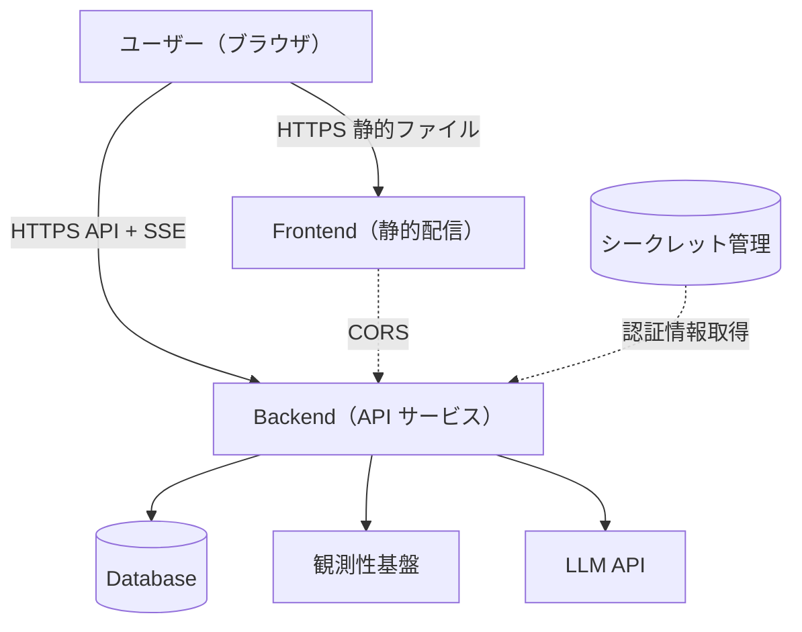
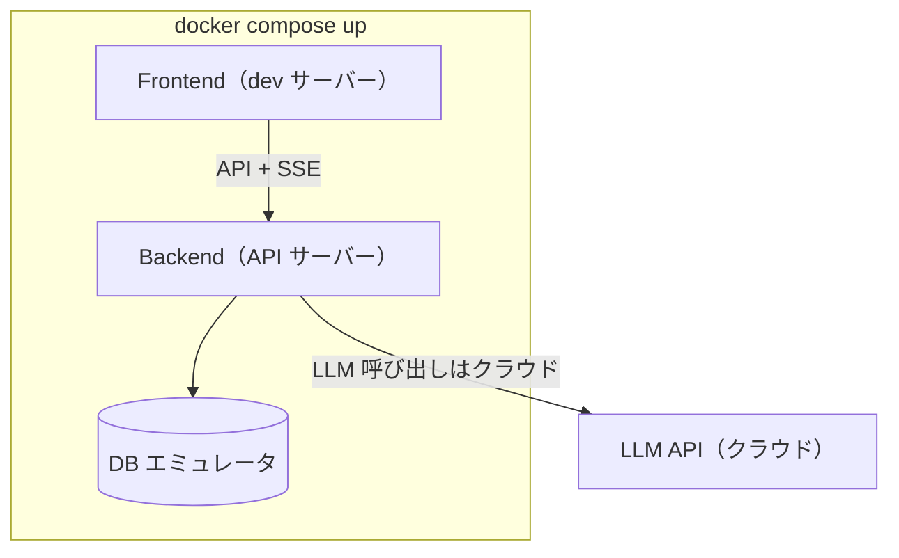
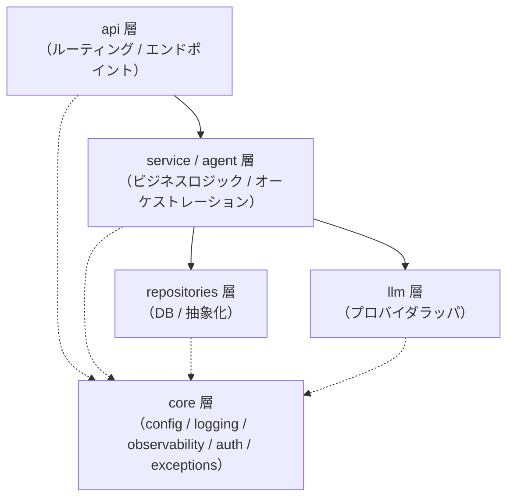
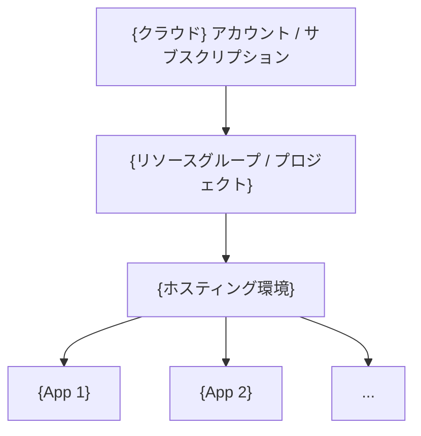

# 技術仕様書

ユーザーから見える仕様は [`functional-design.md`](functional-design.md)、エージェント内部設計は [`agent-design.md`](agent-design.md) に記載する。
このファイルは **システム全体の配線・技術スタック・通信方式・観測性・運用** に集中する。

> **本テンプレの想定**: AI エージェント Web アプリ。具体的な実装スタック（クラウド / 言語 / フレームワーク / ライブラリ）は移植先で決定し、本ファイル中の `{...}` プレースホルダと「例: {...}」併記を該当する技術名に置換する。マルチクラウド対応関係は §11 を参照。

---

## 1. システム構成図

### 1.1 本番構成



### 1.2 ローカル開発構成



ローカルでも LLM 呼び出しは実プロバイダを叩く（モックで完結はしない）。コスト管理のため `MAX_TOOL_TURNS` / `MAX_TOKENS_PER_SESSION` で上限制御する。

---

## 2. テクノロジースタック

> **未確定**: プロジェクト構成に合わせてセクションを追加・削除する。フロントエンド/バックエンドがない場合は該当セクションを削除する。

### 2.1 フロントエンド

| 項目 | 技術 | 選定理由 |
|---|---|---|
| ビルド | `{ビルドツール}`（例: Vite / Webpack / Turbopack） | {高速ビルド、静的出力等} |
| UI フレームワーク | `{UI フレームワーク + 言語}`（例: React + TypeScript / Vue + TypeScript / Svelte） | {エコシステム充実} |
| ルーティング | `{ルーティング}`（例: React Router / TanStack Router / Next.js） | {} |
| サーバー状態 | `{サーバー状態管理}`（例: TanStack Query / SWR / RTK Query） | {} |
| クライアント状態 | `{状態管理}`（例: Zustand / Redux / Recoil / Pinia） | {} |
| スタイリング | `{スタイリング}`（例: Tailwind CSS / CSS Modules / styled-components） | {} |
| UI コンポーネント | `{UI コンポーネントライブラリ}`（例: shadcn/ui / MUI / Mantine） | {} |
| テスト | `{テストランナー}`（例: Vitest / Jest） | {} |

### 2.2 バックエンド

| 項目 | 技術 | 選定理由 |
|---|---|---|
| 言語・ランタイム | `{言語ランタイム}`（例: Python / Node.js / Go / JVM） | {} |
| Web フレームワーク | `{Web フレームワーク}`（例: FastAPI / Express / Hono / Spring Boot / Rails） | {async 対応、型統合等} |
| 設定管理 | `{設定管理}`（例: Pydantic Settings / dotenv / Viper） | {型安全、環境変数優先} |
| ロギング | `{構造化ログライブラリ}`（例: structlog / pino / Logback） | {JSON 出力} |
| LLM 抽象化 | `{LLM 抽象化層}`（例: LiteLLM / Vercel AI SDK / LangChain） | {複数プロバイダ対応} |
| Lint / Format | `{Lint/Format}`（例: Ruff / Biome / ESLint + Prettier） | {} |
| 型チェック | `{型チェッカ}`（例: mypy / tsc / 言語標準） | {} |
| テスト | `{テストランナー}`（例: pytest / Vitest / JUnit） | {} |

### 2.3 データ層

| 項目 | 技術 | 選定理由 |
|---|---|---|
| プライマリ DB | `{DB}`（例: CosmosDB Serverless / DynamoDB / Firestore / PostgreSQL） | {従量課金、軽使用時のコスト等} |
| クエリ言語 | `{クエリ言語}`（例: Cosmos SQL / SQL / NoSQL クエリ API） | {} |
| ローカル | `{ローカル代替}`（例: DB エミュレータ / Docker コンテナ DB） | {} |

### 2.4 インフラ

| 項目 | 技術 | 選定理由 |
|---|---|---|
| クラウド | `{クラウド}`（例: Azure / AWS / GCP） | {予算・サービス可用性} |
| 静的サイトホスティング | `{静的ホスティング}`（例: Static Web Apps Free / S3 + CloudFront / Cloud Storage + CDN / Firebase Hosting） | {} |
| コンテナサービス | `{コンテナサービス}`（例: Container Apps Consumption / App Runner / Cloud Run） | {スケールトゥーゼロ} |
| シークレット管理 | `{シークレット管理}`（例: Key Vault / Secrets Manager / Secret Manager） | {} |
| IaC | `{IaC}`（例: Terraform / Pulumi / CDK） | {} |
| CI/CD | `{CI/CD}`（例: GitHub Actions / GitLab CI / CircleCI） | {} |

---

## 3. LLM 基盤レイヤ

> **未確定**: エージェント機能を使わないプロジェクトはこの章ごと削除する。

### 3.1 LLM 呼び出し方式

`{LLM 抽象化層}`（例: LiteLLM / Vercel AI SDK）を採用すれば `model` 文字列の切替で全プロバイダ対応：

```python
# 例（LiteLLM Python の場合）
import litellm

response = await litellm.acompletion(
    model=settings.llm.model,    # 環境変数で切替
    messages=[...],
    tools=[...],
    stream=True,
    temperature=0.0,
)
```

| プロバイダ | model 文字列例 |
|---|---|
| Azure OpenAI | `azure/gpt-4o-mini` |
| AWS Bedrock | `bedrock/anthropic.claude-...` |
| GCP Vertex AI | `vertex_ai/gemini-...` |
| Anthropic API | `anthropic/claude-...` |
| OpenAI API | `openai/gpt-...` |

### 3.2 認証

| 環境 | 認証方式 |
|---|---|
| ローカル開発 | API キー（`.env` の `{LLM_API_KEY}`） |
| 本番 | クラウドネイティブ ID（例: Azure Managed Identity / AWS IAM Role / GCP Workload Identity） |

API キーをコードに直書きしない。クラウドのシークレット管理サービス（例: Key Vault / Secrets Manager / Secret Manager）→ ID 経由で取得する。

### 3.3 LLM プロバイダの動向

LLM プロバイダ・モデルの可用性は急速に変化する。**案件着手時に `tech-researcher` エージェントで最新動向を確認した上で経路を選ぶ**。

> **未確定**: 採用するプロバイダの最新公式動向（例: Microsoft Foundry / AWS Bedrock 新モデル / Vertex AI Gemini 新世代等）をここに記載する。

---

## 4. アーキテクチャパターン

### 4.1 バックエンドのレイヤ構造

論理レイヤと依存方向（単方向）：



実線は呼び出し方向（単方向）。点線は横断的関心事（`core` は全レイヤーから参照可能）。実際のディレクトリ配置は [`repository-structure.md`](repository-structure.md) を参照。

### 4.2 依存性注入

DI を活用し、テスト時はモックに差替え可能にする：

```python
# 例（FastAPI の Depends の場合）
async def get_current_user(...) -> User:
    """JWT 検証 → users コンテナ参照"""
    ...

@router.post("/chat")
async def chat(
    request: ChatRequest,
    current_user: User = Depends(get_current_user),
):
    ...
```

テスト時は DI コンテナ等のモック差替え機構を使う（FastAPI なら `app.dependency_overrides`、Spring なら `@MockBean` など）。

### 4.3 Repository パターン

各エンティティは Generic Base から継承で CRUD を得る。API 層は Repository 経由でのみデータアクセスし、`raw` のクライアントを直接触らない。

```python
# 例（Generic 型サポートのある言語の場合）
class BaseRepository(Generic[T]):
    container_name: str
    model: type[T]

    async def get_by_id(self, id, partition_key) -> T | None: ...
    async def query(self, sql, params) -> list[T]: ...
    async def upsert(self, item) -> T: ...
```

### 4.4 例外階層

カスタム例外階層を定義し、API 層でフレームワーク固有の HTTP エラー型に変換する：

| 例外 | HTTP | 用途 |
|---|---|---|
| `AppException` | 500 | 基底 |
| `NotFoundException` | 404 | リソース未存在 |
| `ValidationException` | 422 | 入力検証失敗 |
| `AuthException` | 401 | 認証失敗 |
| `ForbiddenException` | 403 | 認可失敗 |
| `ExternalServiceException` | 502 | 外部サービスエラー |

実装は `{backend ルート}/{core ルート}/exceptions.{言語拡張子}` を参照。

---

## 5. 通信方式

### 5.1 API 全般

- HTTPS（本番では TLS 1.2+）
- JSON ボディ
- 認証: `Authorization: Bearer <jwt>` ヘッダで JWT
- CORS: フロント配信先のドメインのみ許可（`"*"` 禁止）

### 5.2 ストリーミング（SSE）

> **未確定**: ストリーミングを使わない場合は本サブセクションを削除する。

チャットレスポンスは SSE で配信する。エンドポイントとリクエスト/レスポンス形式の詳細は [`functional-design.md` §3.2](functional-design.md#32-主要エンドポイントの仕様) を参照。

```python
# 例（FastAPI StreamingResponse の場合）
@router.post("/chat")
async def chat_stream(request, orchestrator = Depends(get_orchestrator)):
    async def event_stream():
        async for event in orchestrator.stream(request.message, ...):
            yield f"data: {event.model_dump_json(exclude_none=True)}\n\n"

    return StreamingResponse(
        event_stream(),
        media_type="text/event-stream",
        headers={"Cache-Control": "no-cache", "X-Accel-Buffering": "no"},
    )
```

採用基準：依存追加なし / 最小ペイロード / 必要に応じてハートビート対応のライブラリ（FastAPI なら `sse-starlette`、Node.js なら自前 + setInterval 等）に切替可能（拡張ポイント）。

### 5.3 SSE のリバースプロキシ越え

> **重要**: SSE はリバースプロキシ（nginx・Cloudflare 等）でバッファされると機能しない。

レスポンスに `X-Accel-Buffering: no` ヘッダを付与し、nginx を挟む場合は以下を設定する：

```nginx
location /chat/stream {
    proxy_pass http://backend;
    proxy_buffering off;
    proxy_cache off;
    proxy_set_header Connection "";
    proxy_http_version 1.1;
}
```

### 5.4 認証フロー（OIDC PKCE）

```
[フロント]
1. ユーザーがログインボタンクリック
2. {認証ライブラリ}（例: MSAL / Auth0 SPA SDK / @react-oauth/google）で認可コードフロー（PKCE）
3. ID トークン（JWT）を取得し localStorage に保存
4. API 呼び出し時に Authorization: Bearer <jwt> ヘッダで送信

[バックエンド]
5. JWKS を取得・キャッシュ → issuer / audience / exp / 署名を検証
6. (provider, sub) で users コンテナを点参照
7. 初回なら role を `INITIAL_ADMIN_EMAILS` 相当の env で判定して upsert
8. current_user として注入（`DEBUG_MODE=true` 時はステップ 1〜6 をスキップ）
```

users コンテナのスキーマ：

```jsonc
{
  "id": "{provider}:{sub}",   // partition key も id と同値（O(1) point read）
  "provider": "{ID プロバイダ識別子}",   // 例: "entra" / "google" / "cognito" / "debug"
  "sub": "...",                 // JWT claim
  "email": "...",
  "role": "{admin | user}",     // ロール初期化変数で初回ログイン時に決定
  "created_at": "..."
}
```

---

## 6. 環境変数

本セクションは設計判断の記録として用途別に整理する。**変数の実体（値・コメント・最新の追加分）は [`.env.example`](../.env.example) を真とする**。変数名は採用する認証プロバイダ・LLM プロバイダ・観測性基盤に応じて命名を変える。

### 6.1 認証

| 変数名（例） | 用途 | デフォルト | 必須 | 備考 |
|---|---|---|---|---|
| `AUTH_PROVIDER` | 認証プロバイダ | — | ✅ | 例: `entra` / `google` / `cognito` / `auth0` |
| `{TENANT_ID}` | テナント ID | — | ✅ | 例（Entra の場合）: `ENTRA_TENANT_ID` |
| `{CLIENT_ID}` | クライアント ID | — | ✅ | 例: `ENTRA_CLIENT_ID` / `GOOGLE_CLIENT_ID` |
| `JWT_AUDIENCE` | JWT audience claim 検証値 | `{CLIENT_ID}` | — | フォールバック |
| `INITIAL_ADMIN_EMAILS` | 初回ログイン時 admin 付与 | — | — | カンマ区切り |
| `DEBUG_MODE` | 認証バイパス | `false` | — | `true` でバイパス |

### 6.2 LLM

| 変数名（例） | 用途 | デフォルト | 必須 | 備考 |
|---|---|---|---|---|
| `LLM_MODEL` | model 文字列 | `{provider/model}` | — | 抽象化層採用時はプロバイダ切替が文字列変更のみ |
| `LLM_TEMPERATURE` | サンプリング温度 | `0.0` | — | 再現性優先 |
| `LLM_MAX_TOKENS` | 1 応答の上限 | `2000` | — | |
| `LLM_TIMEOUT_SECONDS` | 1 呼び出しタイムアウト | `60` | — | |
| `LLM_MAX_TOOL_TURNS` | ReAct ループ上限 | `10` | — | |
| `{LLM_API_BASE}` | エンドポイント | — | ✅ | 例: `AZURE_API_BASE` / `OPENAI_API_BASE` |
| `{LLM_API_KEY}` | API キー | — | ✅（ローカル） | 本番はクラウドネイティブ ID |

### 6.3 データ層

| 変数名（例） | 用途 | デフォルト | 必須 | 備考 |
|---|---|---|---|---|
| `{DB_ENDPOINT}` | エンドポイント | — | ✅ | 例: `COSMOS_ENDPOINT` / `DATABASE_URL` |
| `{DB_KEY}` | 接続キー | — | ✅（ローカル） | 本番はクラウドネイティブ ID |
| `{DB_DATABASE}` | データベース名 | `app-db` | ✅ | |

### 6.4 アプリ基盤

| 変数名 | 用途 | デフォルト | 必須 | 備考 |
|---|---|---|---|---|
| `ENV` | 実行環境 | `local` | — | `local / development / production` |
| `LOG_LEVEL` | ログ出力レベル | `INFO` | — | `DEBUG / INFO / WARNING / ERROR` |
| `LOG_FORMAT` | ログ出力形式 | `human` | — | `human / json`（本番は `json`） |

### 6.5 観測性

| 変数名（例） | 用途 | デフォルト | 必須 | 備考 |
|---|---|---|---|---|
| `OTEL_SERVICE_NAME` | OTel サービス名（OTel 標準規約） | `{プロジェクト名}` | ✅ | デモごとに変更、未設定で起動失敗 |
| `{観測性接続文字列}` | 観測性基盤の接続情報 | — | 本番のみ | 例（Application Insights）: `APPLICATIONINSIGHTS_CONNECTION_STRING` / 例（Datadog）: `DD_API_KEY`。未設定ならコンソール OTel exporter にフォールバック |

### 6.6 シークレット管理

| 環境 | 方法 |
|---|---|
| ローカル | `.env`（Git 管理外） |
| 本番 | クラウドのシークレット管理サービス（例: Key Vault / Secrets Manager / Secret Manager）→ クラウドネイティブ ID 経由で取得 |

`.env.example` をリポジトリに含め、必要な変数名とコメントを記載する。**実値はコミットしない**。

---

## 7. 観測性

### 7.1 構成

| 項目 | 値 |
|---|---|
| トレーシング基盤 | `{観測性基盤}`（例: OpenTelemetry → Application Insights / CloudWatch / Cloud Trace / Datadog） |
| 記録対象 | HTTP / DB / LLM 呼び出し / レイテンシ / エラー |
| 保存先 | `{ストレージ}`（基盤に依存） |
| 保持期間 | {案件次第} |

OTel auto-instrumentation で `{Web FW}` / HTTP / DB が自動計測される。LLM 呼び出しの詳細属性（OTel GenAI Semantic Conventions の `gen_ai.*`）は LLM 抽象化層のコールバックで配線する（拡張ポイント）。

### 7.2 OpenTelemetry の初期化

> **重要**: Web フレームワークの ASGI / WSGI / middleware 構築前にモジュールレベルで初期化する（後だと自動計測が失敗する）。

```python
# 例（FastAPI + azure-monitor-opentelemetry distro の場合）
from app.core.observability import init_observability, instrument_app

init_observability(_settings)   # ← FastAPI 構築前に実行

from fastapi import FastAPI
app = FastAPI(...)
instrument_app(app, _settings)  # 必要に応じてフレームワーク固有 Instrumentor を呼ぶ
```

### 7.3 構造化ログ

`{構造化ログライブラリ}`（例: structlog / pino / Logback）で JSON 出力する。ローカルは人間可読フォーマット、本番は JSON フォーマットで出力するよう環境変数で切替（`LOG_FORMAT=human|json`）。

---

## 8. ローカル開発環境

### 8.1 Docker Compose 構成

3 サービス（`frontend` / `backend` / `db-emulator`）の最小構成。実体は [`docker-compose.yml`](../docker-compose.yml) を参照。設計上の注意点：

| サービス | ベースイメージ（例） | healthcheck コマンド（例） | 注意点 |
|---|---|---|---|
| `db-emulator` | `{DB エミュレータ}` | `curl -f http://localhost:{port}/ready` | プロトコル設定、`start_period` を長めに |
| `backend` | `{言語イメージ slim 系}` | 言語標準ライブラリの HTTP クライアントで代替（`curl` / `wget` 非搭載のため） | slim 系イメージは binary が削られている |
| `frontend` | `{node:alpine 等}` | `wget --spider -q http://127.0.0.1:{port}` | Alpine busybox の `localhost` は IPv6 のみのため `127.0.0.1` 明示が必要なことがある |

### 8.2 起動順序

```bash
docker compose up
```

依存関係は `depends_on: { condition: service_healthy }` で表現する。

### 8.3 起動時間目標

`git clone` から `docker compose up` 完了まで **{3 分以内}**（`docker compose pull` 先行時）。

---

## 9. デプロイ

### 9.1 デプロイトポロジ

> **未確定**: 環境分割（dev / staging / production）または共有環境設計を記載する。



### 9.2 デプロイフロー（CI/CD）

```
{CI/CD}（例: GitHub Actions / GitLab CI / CircleCI）
  ├─ frontend-deploy.yml
  │     - npm ci && npm run build
  │     - 静的サイトホスティングへデプロイ
  │
  ├─ backend-deploy.yml
  │     - docker build
  │     - レジストリへ push
  │     - コンテナサービスを更新
  │
  └─ infra-plan.yml / infra-apply.yml
        - {IaC} plan / apply
```

### 9.3 デプロイ時の落とし穴

| 落とし穴 | 対策 |
|---|---|
| コンテナ起動が遅すぎて 502 | ヘルスチェックを実装してリビジョン安定後に切替 |
| クラウドネイティブ ID がレジストリからプル不可 | identity に `{プル権限ロール}`（例: `AcrPull` / `AmazonECRReadOnly`）付与（IaC で自動化） |
| シークレットが取れない | secrets 設定でシークレット管理サービス参照 |

---

## 10. セキュリティ

### 10.1 デフォルトで有効化される項目

| 項目 | 設定 |
|---|---|
| HTTPS | 全リソースで強制 |
| 認証 | `DEBUG_MODE=false` ならすべての保護リソースで JWT 検証必須 |
| CORS | フロント配信先ドメインのみ allowlist |
| Rate limit | アプリ層 + ホスティング層の組み込み機能 |

### 10.2 シークレット保管

すべての API キー・接続文字列はクラウドのシークレット管理サービス（例: Key Vault / Secrets Manager / Secret Manager）に格納し、クラウドネイティブ ID（例: Managed Identity / IAM Role / Workload Identity）で取得する。コードに直書き禁止、環境変数への直接設定も避ける（`.env` 経由のみローカル開発で許容）。

### 10.3 監査ログ

`{構造化ログライブラリ}` で以下を記録：

- 認証イベント（成功・失敗・JWT 検証エラー）
- ツール呼び出し（誰が・いつ・何を・引数・結果サマリ）
- ガードレール違反イベント
- LLM コスト（1 ターンあたり）
- エラー（種類・スタック）

---

## 11. マルチクラウド対応

本テンプレは特定クラウドに固定せず、採用クラウドで実装する。主要 3 クラウドの対応関係：

| コンポーネント | Azure | AWS | GCP |
|---|---|---|---|
| 静的サイト配信 | Static Web Apps | S3 + CloudFront / Amplify | Cloud Storage + CDN / Firebase Hosting |
| コンテナサービス | Container Apps | App Runner / ECS / Lambda | Cloud Run |
| LLM | Azure OpenAI | Bedrock | Vertex AI |
| NoSQL DB | CosmosDB | DynamoDB | Firestore |
| ID プロバイダ | Entra ID | Cognito | Firebase Authentication |
| 観測性 | Application Insights | CloudWatch + X-Ray | Cloud Trace + Logging |
| シークレット管理 | Key Vault | Secrets Manager | Secret Manager |
| クラウドネイティブ ID | Managed Identity | IAM Role | Workload Identity |
| IaC | Terraform azurerm | Terraform aws | Terraform google |

LLM 抽象化層を採用していれば LLM 切替は環境変数のみで完結する。データ層・認証・観測性は実装差替えが必要。

`tech-researcher` エージェントで案件着手時に最新の対応関係・価格・無料枠制約を再評価する。

---

## 関連ドキュメント

- ユーザー視点の機能仕様 → [`functional-design.md`](functional-design.md)
- エージェント内部設計 → [`agent-design.md`](agent-design.md)
- ディレクトリ構成・配置ルール → [`repository-structure.md`](repository-structure.md)
- コーディング規約・Git 運用 → [`development-guidelines.md`](development-guidelines.md)
- テスト戦略・評価 → [`testing-guidelines.md`](testing-guidelines.md)
- 用語集 → [`glossary.md`](glossary.md)
