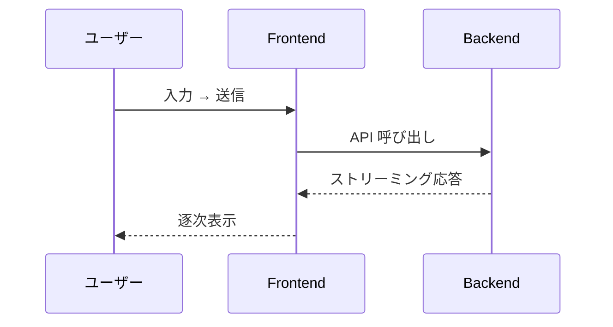
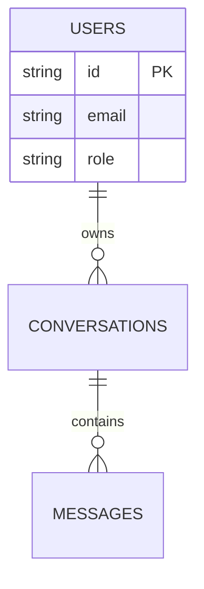

# 機能設計書

エージェント内部の設計（プロンプト・ツール・メモリ・ストリーミング契約）は [`agent-design.md`](agent-design.md)、システム配線・通信方式・認証フロー・観測性は [`architecture.md`](architecture.md) に記載する。
このファイルは **ユーザーから見える仕様**（画面・機能フロー・API 概要・データの論理スキーマ）に集中する。深い設計はクロスリファレンスで他に逃がす。

> **本テンプレの想定**: AI エージェント Web アプリ。具体的な実装スタック（クラウド / 言語 / フレームワーク / ライブラリ）は移植先で決定し、本ファイル中の `{...}` プレースホルダと「例: {...}」併記を該当する技術名に置換する。

---

## 1. 画面構成

> **未確定**: UI がないプロジェクト（API-only / CLI 等）は本章を削除する。

### 1.1 画面一覧

| 画面 | パス | 概要 |
|---|---|---|
| {画面名} | {`/path`} | {概要} |

### 1.2 各画面のワイヤフレーム

ワイヤフレームは ASCII で記述する（[`diagrams.md`](../../.claude/rules/diagrams.md) の例外条件）：

```
┌────────────────────────────────┐
│  Header                        │
├────────────────────────────────┤
│  メインコンテンツ                │
│                                │
├────────────────────────────────┤
│  入力エリア            [送信]   │
└────────────────────────────────┘
```

### 1.3 画面状態

- **空状態**: {表示条件と内容}
- **ローディング**: {表示条件と内容}
- **エラー**: {表示条件と内容}
- **完了**: {通常表示への戻し方}

---

## 2. 機能フロー

ストリーミング契約の詳細は [`agent-design.md`](agent-design.md) §ストリーミング契約 を参照。

### 2.1 主要フロー



### 2.2 イベント / レスポンスの UI 反映

> **未確定**: エージェント機能を使わない場合は本サブセクションを削除する。詳細な契約（ペイロード・タイミング）は [`agent-design.md`](agent-design.md) を参照。

| イベント | 発火タイミング | UI への反映 |
|---|---|---|
| {イベント名} | {タイミング} | {表示} |

### 2.3 中断・エラー・リトライ

- **中断**: {操作と挙動}
- **エラー**: {検知方法と表示}
- **リトライ**: {再送条件と引き継ぎ}

---

## 3. API 仕様

### 3.1 エンドポイント一覧

| メソッド | パス | 概要 | 認証 |
|---|---|---|---|
| {`POST`} | {`/api/...`} | {概要} | {必須 / 任意} |

### 3.2 主要エンドポイントの仕様

主要エンドポイントごとにリクエスト / レスポンス例を記載する。通信方式・リバースプロキシ越え・認証フロー詳細は [`architecture.md`](architecture.md) §通信方式 を参照。

#### 3.2.1 `{POST /api/...}`

**リクエスト**:

```jsonc
{
  "field": "value"   // 必須・1〜N 字
}
```

**レスポンス**:

{形式と例}

### 3.3 認証

`Authorization: Bearer <jwt>` ヘッダで JWT を送信。`DEBUG_MODE=true` 等のバイパス条件は [`architecture.md`](architecture.md) §認証フロー を参照。

---

## 4. データモデル

主要エンティティとリレーションを記載する。RDB なら ER 図、NoSQL ならコンテナ全体図 + 役割表で示す。

### 4.1 コンテナ / テーブル全体図



### 4.2 各コンテナ / テーブルの役割

| コンテナ / テーブル | 役割 | パーティションキー / 主キー | 実装状況 |
|---|---|---|---|
| {`users`} | {役割} | {`/id`} | {実装済 / 未実装} |

### 4.3 主要スキーマ

中心的なエンティティのスキーマを JSON / DDL で示す。

```jsonc
{
  "id": "...",        // 一意 ID
  "field": "..."
}
```

---

## 関連ドキュメント

- ストリーミング契約の詳細・ツールカタログ・プロンプト構成 → [`agent-design.md`](agent-design.md)（エージェント機能を使う場合）
- システム構成・通信方式・認証フロー・環境変数 → [`architecture.md`](architecture.md)
- ファイル配置（フロント / バックエンド / docs） → [`repository-structure.md`](repository-structure.md)
- 用語の定義 → [`glossary.md`](glossary.md)
